[id='gs-adding-users-proc']

= Managing Users

How to manage users within the {PRODUCT} environment.

== Accessing the Red Hat Single Sign-On administration console
. Login to the OpenShift console as the `customer-admin` user. 
. Navigate to the *sso* project.
. Retrieve the credentials for the Red Hat Single Sign-On administration console:
.. Click *Secrets* in the *Resources* menu.
.. Click *credential-rhsso* in the list of Secrets.
.. Click *Reveal Secret* in the  *credential-rhsso* detail page.
.. Note the values for *SSO_ADMIN_USERNAME* and *SSO_ADMIN_PASSWORD*.
.. Click *Overview* to navigate back to the *sso* project overview page.

. Click *Routes* in the *Applications* menu.
. Click on the *sso* route hostname to open the Red Hat Single Sign-On (SSO) application.
- Click on the *Administration Console* option on the Red Hat Single Sign-On landing page.
- Login to the Red Hat Single Sign-On administration console.

== Viewing Users in the SSO Admin Console
- Navigate to the *Users* menu.
- Click the *View all users* button at the top of the page. This will show the list of users currently available in the Integreatly environment.

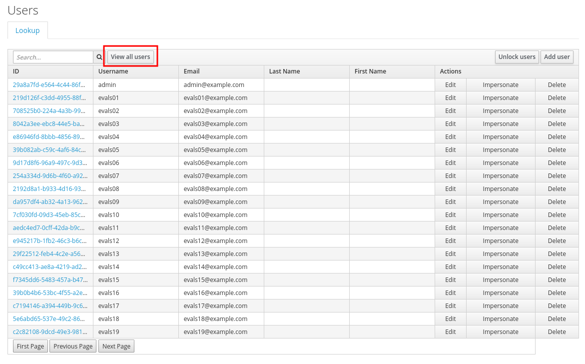

- The search box at the top of the page can be used to query the list and only show users that matches your criteria.

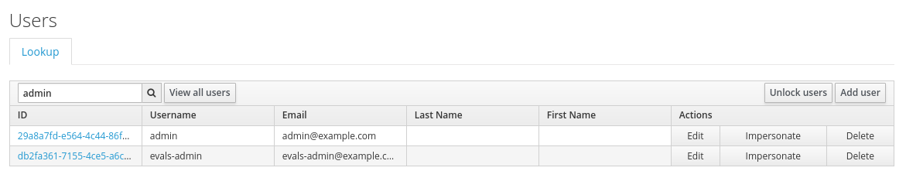

== Creating Users in the SSO Admin Console
- Navigate to the *Users* menu.
- Click the *Add User* button at the top right corner of the page.

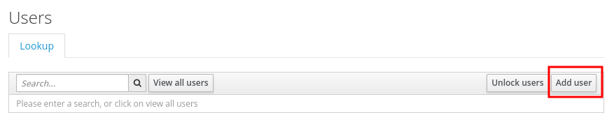

- Enter the user information required in the user creation form.
  * Ensure that the `Username` and `Email` fields are filled in.
  * Ensure that field `User Enabled` is set to *ON*. This ensures that the user account will be activated and can be used for login.
  * Ensure that the field `Email Verified` is set to *ON*. This ensures that the user account will be activated in 3Scale.

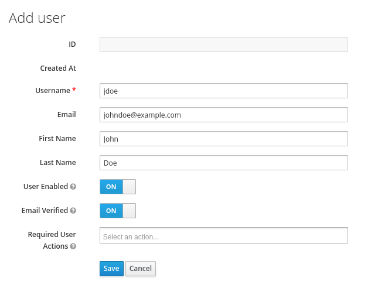

- Click the *Save* button to create the user.

NOTE: Users can also be created by importing a JSON file with user information via the SSO admin console. For more information, please see the https://access.redhat.com/documentation/en-us/red_hat_single_sign-on/7.2/html/server_administration_guide/export_import#admin_console_export_import[SSO documentation] and the example https://gist.github.com/JameelB/da0a082cade4c7a19c966bba2869743c[users.json] file.

=== Setting User Password
- Navigate to the *Users* menu.
- Find the user you wish to edit and click on their *Edit* button associated with the user.
- Go to the *Credentials* tab.
- Set a password for the user and click the *Reset Password* button to save.
- Set the `Temporary` field to *ON* only if you require the user to update their password upon login. 

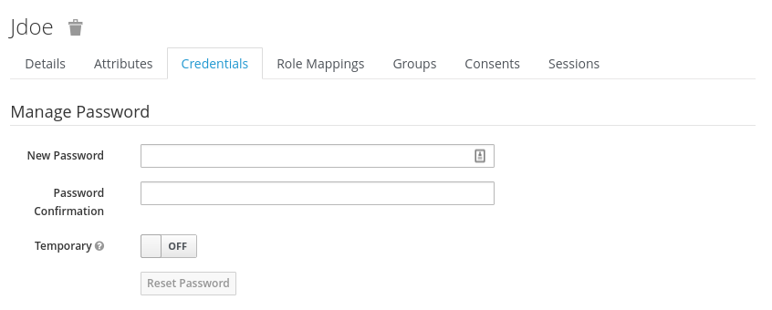

The newly created user should now be ready to be used to login to the OpenShift console and all the Integreatly services.

== Deleting Users in the SSO Admin Console
- Navigate to the *Users* menu
- Click the *View all users* button at the top of the page.
- Find the user you wish to delete
- Click the *Delete* button associated to the user you wish to remove.

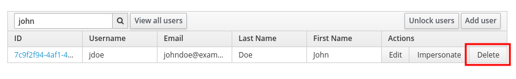

- Click *Delete* in the confirmation box to proceed.

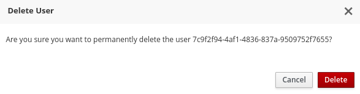

The user should now be deleted from the SSO and will no longer be available to login to the OpenShift console and Integreatly services.

== User Management in 3Scale
Users created in the OpenShift SSO can be used to login to the 3Scale console. The user's account will only be created in 3Scale once a user attempts to login to the 3Scale console. The user created is assigned the role `member` and no permissions set by default. 

The user role and permission can only be set once a user account is created in 3Scale. Because of this, the only way to change the user's role/permission before the user attempts to login to the 3Scale console is to create a user account that matches the account created in the OpenShift SSO.

=== Accessing the 3Scale Administration Console
- Navigate to the '3scale' project
- Go to *Applications* > *Routes*
- Click on the `system-provider-admin` hostname to open the 3scale admin console

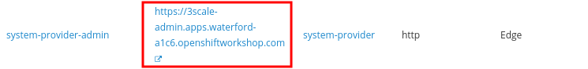

- Login to the 3Scale admin console by clicking on the *Authenticate through Red Hat Single Sign-On* button.

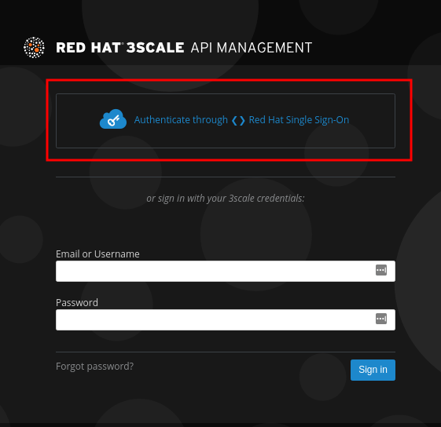

- If asked for credentials, login as the `customer-admin` user.

=== Creating Users in 3Scale
The user accounts that will be created in 3Scale must match the user account created in the OpenShift SSO.

NOTE: This is only required if you wish to set the user's role and permission before the user login to the 3Scale console.

==== Retrieve the 3Scale Access Token
The 3Scale API needs to be used in order to create users in 3Scale. An `access_token` is required in order to send requests to the 3Scale API.

- Navigate to the `3scale` project on OpenShift.
- Go to *Resources* > *Secrets*.
- Search for the `system-seed` secret and click on it to view it's details.
- Click on the *Reveal Secret* button to show the secret values.

- Take not of the `ADMIN_ACCESS_TOKEN` value as this will be required when sending requests to the 3Scale API.

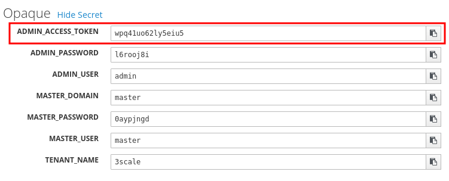

==== Using the 3Scale API
In order to create a user, a *POST* request must be sent to the 3Scale API user endpoint.

- Navigate to the `3scale` project.
- Go to *Applications* > *Routes*
- Append the user endpoint */admin/api/users.xml* to the `system-provider-admin` hostname.

The request requires the following parameters. Each of these properties must match with the properties of the user that was created in the OpenShift SSO.

- *access_token* (String): The `ADMIN_ACCESS_TOKEN` value retrieved from the `system_seed` secret. This token lets you authenticate against the 3Scale API.
- *username* (String): Username of the user
- *email* (String): Email of the user
- *password* (String): Password of the user

Example: 

[source, bash]
curl --data “access_token=wpq41uo62ly5eiu5&username=jdoe&email=johndoe@example.com&password=Password1” https://3scale-admin.apps.waterford-a1c6.openshiftworkshop.com/admin/api/users.xml

This request can also be done through the 3Scale API documentation in the 3Scale console.
- Click on the *Documentation* icon on the top right corner of the page.
- Click on the *3Scale API Docs* from the documentation menu

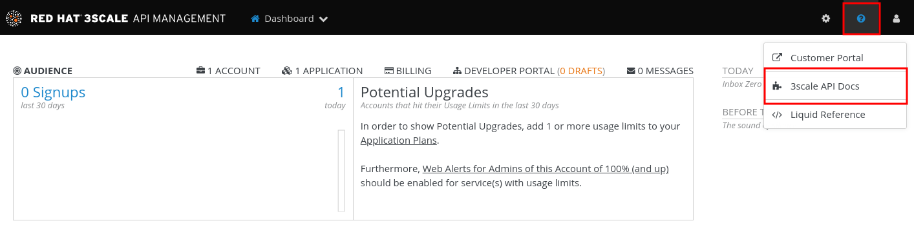

- Go to the *User Create (provider account)* section and click on it to view the endpoint's description.

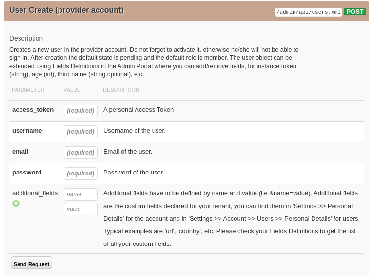

- Fill in the required parameters.
- Click the *Send Request* button to create a user.
- The response for the request sent will be shown below the *Send Request* button.

=== Setting User Roles and Permissions in 3Scale
All users in 3Scale are created as a `member` with no permissions set by default. The 3Scale console allows you to manage user roles and permissions after a user account is created in 3Scale.

- Navigate to *Account Settings*

image:../assets/images/gs-adding-users-3scale-account-settings.png[3Scale account settings]

- Go to *Users* > *Listings*. This page shows all the users available in 3Scale.
- Search for the user that you wish to change roles and permissions for. 
- Click on the *Edit* button associated with the user.

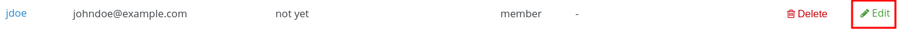

- The *Edit User* page allows you to change the user's information, password, roles and permissions.

image:../assets/images/gs-adding-users-3scale-edit-user-page.png[3Scale edit user page]

- Click on the *Update User* button at the bottom of the page to save your changes.

=== Deleting Users in 3Scale
- Navigate to *Account Settings*.

image:../assets/images/gs-adding-users-3scale-account-settings.png[3Scale account settings]

- Go to *Users* > *Listings*.
- Find the user you wish to delete.
- Click the *Delete* button associated with that user.

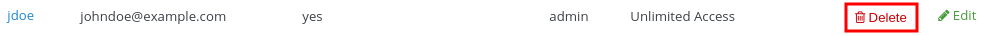
